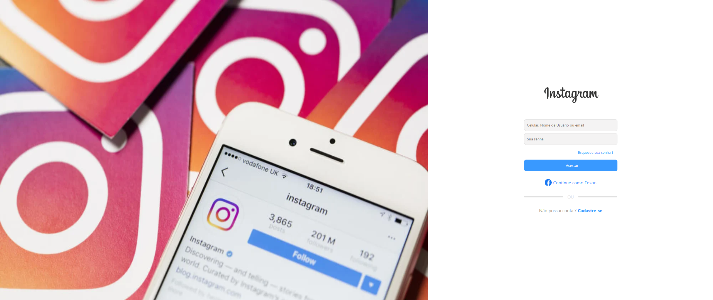
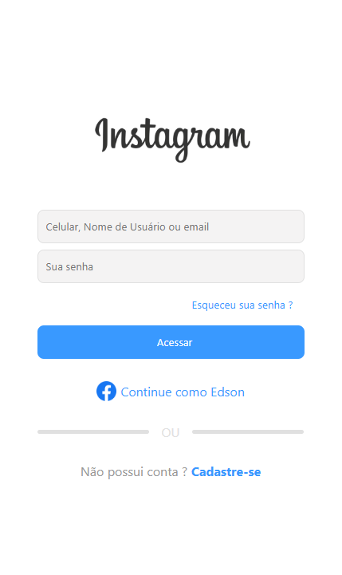

# Instagram Login Recreation

**Recriação inspirada na tela de Login e Cadastro do Instagram — focada em HTML + CSS e responsividade**

### Desktop

### Mobile

---

---

### O que foi feito

- Recriação inspirada na tela de login do Instagram (versão 2025)
- Totalmente responsivo (desktop → mobile)
- Sem frameworks, sem JavaScript — apenas HTML semântico e CSS puro
- Ênfase em layout, Flexbox, Grid e animações suaves via CSS
- Campos de usuário/email, senha, botão de login e opção de cadastro(AINDA não funciona)
